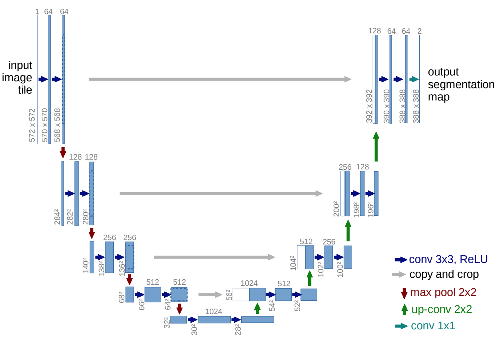

# unet_semantic_segmentation
Semantic segmentation with U-Net model on InteractiveSegmentation dataset (PyTorch)

<h2>U-Net</h2>

U-Net is a neural model which initially has been proposed for biomedical image segmentation. This model is a <b>fully-convolutional network (FCN)</b>, i.e., there is no fully-connected layer at the end similar to classification models. This modification makes this network an appropriate choice for semantic segmentation, where instead of classifying the whole image in different classes, U-Net can do the classification in the level of pixels. The following figure illustrates the U-Net architecture. The model's scheme clarifies the meaning of the name of this model as the model follows a U-pattern.
 
  
   
U-Net is cretaed from two main modules:
 
<b>Contratcting path</b> (left side of the figure), which its main task is to exploit the features of the input images. This path is cretaed from mutliple stacks of [conventional 2D convolutional layers, batch normalization layers, and ReLU activation function]. Note that the original paper does not use batch normalization. This modification has been done to have a more stable training independent of the initialization values. After each two consequitive convolutional stacks, a maxpooling layer with kernel and stride of 2 halves the spatial size of the input image. As the figure shows each convolutional stack, i.e., each row on the left side, increases the number of dimensions while at the same time, reduces the soatial size by using the kernel (3,3). In our modification, for better  
 
<b>Expansive path</b>, The model tries to recreate the image, and apply the learnt mask for semantic segmentation. In each row of expansive path, first a feature representation from the equivalent level in the contracting path is concatenated through the channels dimension. for increasing the spatial size, the model uses 2D transposed convolutions with kernel and stride size of 2, to double the height and width.
 
 
